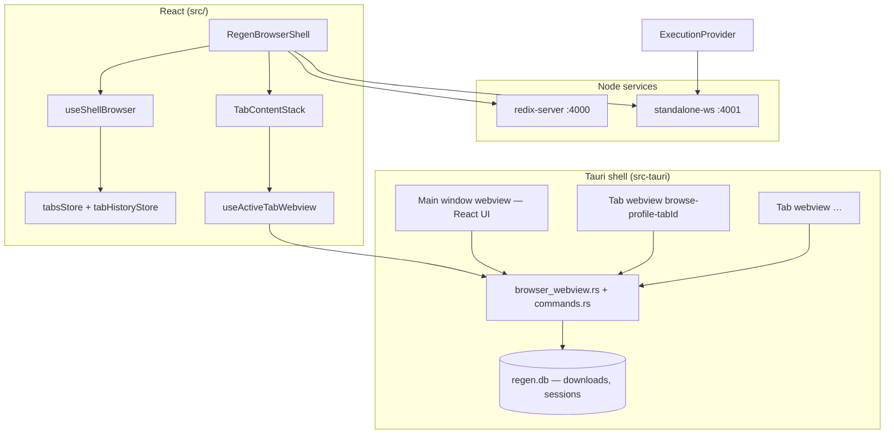
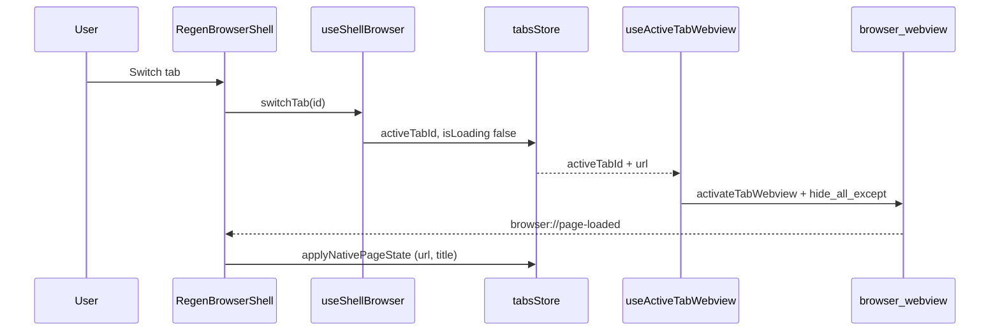

# Regen Browser — system architecture

Regen is a **Tauri 2 desktop browser** with a **React** UI, **per-tab native WebView2** children on Windows, and optional **iframe** fallback. AI features (companion sidebar, page summary, research) sit beside browsing—not inside the web engine.

## High-level diagram



## Runtime layers

| Layer | Technology | Responsibility |
|-------|------------|----------------|
| **UI chrome** | React + Vite | Tabs, URL bar, avatar, ⌘K palette, foundation panel |
| **Tab state** | Zustand (`tabsStore`) | Active tab, URLs, loading flags, persistence |
| **Browse surface** | Native WebView2 **or** iframe | Renders web content per tab |
| **Sync** | `tabWebviewSync` + `useActiveTabWebview` | One native view per tab; hide/show on switch |
| **IPC** | Tauri `invoke` | `browser_webview_*`, downloads, page extract |
| **Execution** | WebSocket `:4001` | Agent runs, streaming (optional in dev) |
| **API** | Fastify/redix `:4000` | Summarize, health, legacy routes |

## Browser data flow



### Ownership rules (avoid regressions)

1. **`useActiveTabWebview`** — only place that shows/hides native webviews on tab or URL change.
2. **`useShellBrowser`** — navigation, back/forward (native `history.back` when native engine), new tab.
3. **`nativePageSync`** — listens to `browser://did-navigate` / `browser://page-loaded`; updates store from OS webview truth.
4. Do **not** destroy webviews on tab switch; use `browser_webview_hide_all_except`.

## Native webview model

- Label: `browse-{profileId}-{tabId}` (see `browser_webview.rs`).
- **Upsert** on navigate; **activate** sets visible + bounds.
- **Bounds**: `webviewBounds.ts` — sidebar width, chrome height, status bar.
- **Engine** (`browseEngineStore`): `native` | `iframe` | `auto`.

## Key frontend modules

| Path | Role |
|------|------|
| `components/BrowserShell/RegenBrowserShell.tsx` | Main browser UI |
| `components/BrowserShell/TabContentStack.tsx` | Per-tab panes (mounted, one visible) |
| `hooks/useShellBrowser.ts` | navigate, tabs, back/forward, reload |
| `hooks/useActiveTabWebview.ts` | Native activate + clear loading |
| `hooks/useWebviewLayoutSync.ts` | Resize → set_bounds |
| `lib/browser/tabWebviewSync.ts` | IPC queue, activate, hide |
| `lib/browser/tabWebviewNav.ts` | reload, go_back, go_forward |
| `lib/browser/nativePageSync.ts` | URL/title sync from Rust events |
| `lib/browser/browserDownloads.ts` | URL + text downloads |
| `state/tabsStore.ts` | Tab list + `regen-tabs` persist |

## Rust / Tauri

| Path | Role |
|------|------|
| `src-tauri/src/main.rs` | Command registration, app setup |
| `src-tauri/src/browser_webview.rs` | Child webviews, events, extract |
| `src-tauri/src/commands.rs` | Downloads, DB, shared commands |

Events emitted to frontend:

- `browser://did-navigate`
- `browser://page-loaded`
- `browser://download-complete`

## Development topology

```text
npm run dev  →  scripts/dev-smart.js
                 ├─ dev:web          (Vite :5173)
                 ├─ dev:server       (API :4000)  if down
                 ├─ dev:execution-ws (:4001)      if down
                 └─ dev:tauri        (desktop)    if cargo present
```

## Routes

Primary product surface: **`/`** and **`/browser`** → `RegenBrowserShell`.

Other routes (`/agent-console`, `/research`, …) are auxiliary tools; see `src/App.tsx`.

## Related docs

- [REPOSITORY.md](./REPOSITORY.md) — folder layout and Git conventions
- [PERFORMANCE.md](./PERFORMANCE.md) — performance notes
- [../DEVELOPER.md](../DEVELOPER.md) — ports and env
- [../TROUBLESHOOTING.md](../TROUBLESHOOTING.md)
